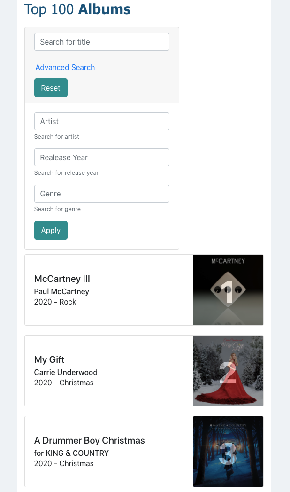
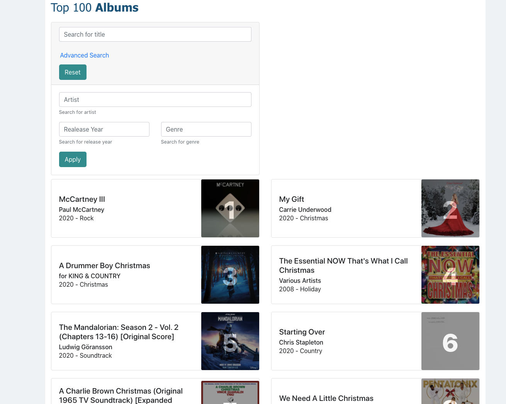

## Description

A little application to list the current top 100 Albums on Itunes

I used

- `create-react-app`
- `react-bootstrap`
- testing:
  - `react-testing-library`
  - `jest`

---

## What I learned

- how to use [react-bootstrap](https://react-bootstrap.github.io/)
- the use of css flexbox inside `react-bootstrap`
- handle advanced filtering for inputs

---

## Scripts

run `yarn` to install deps.

run `yarn start` to start locally

run `yarn test` to run tests

---

## To Do's

- refactor MainView.js
- add different categories alongside albums, i.e. podcasts, songs, etc.
- add tests for more coverage
